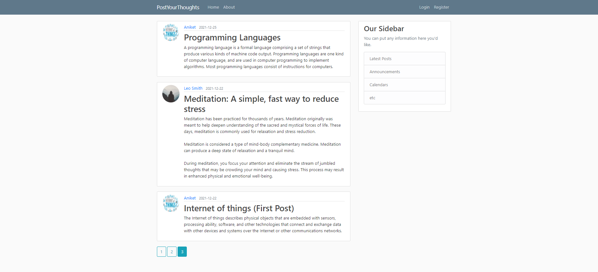
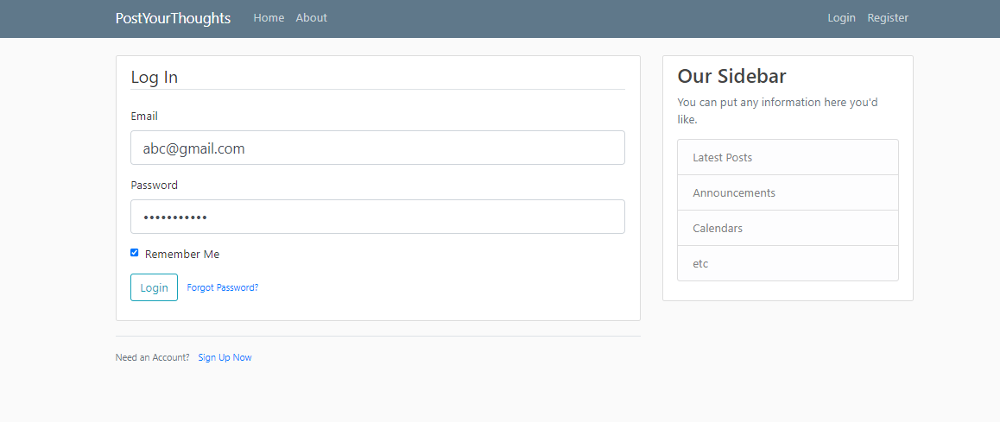
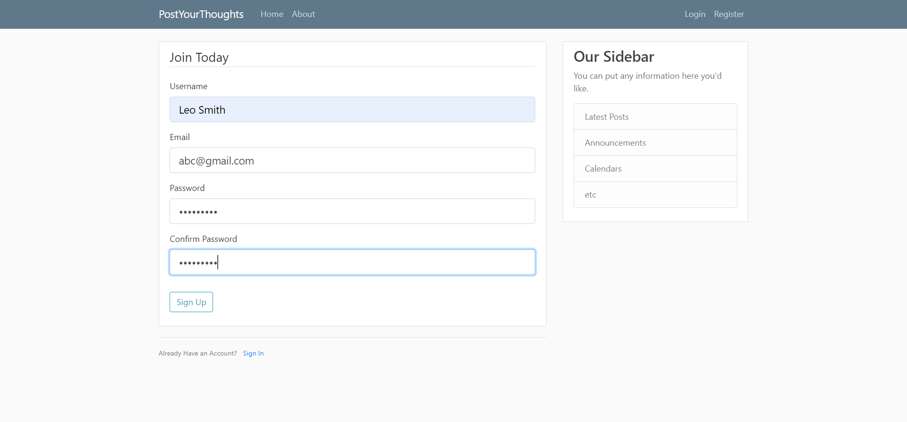
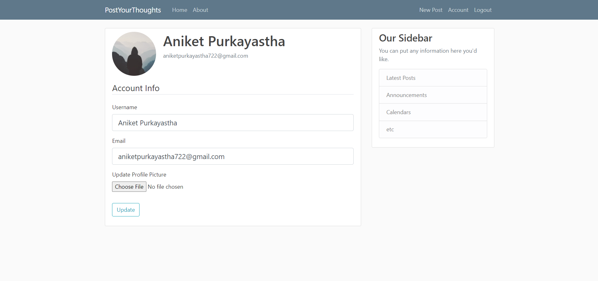
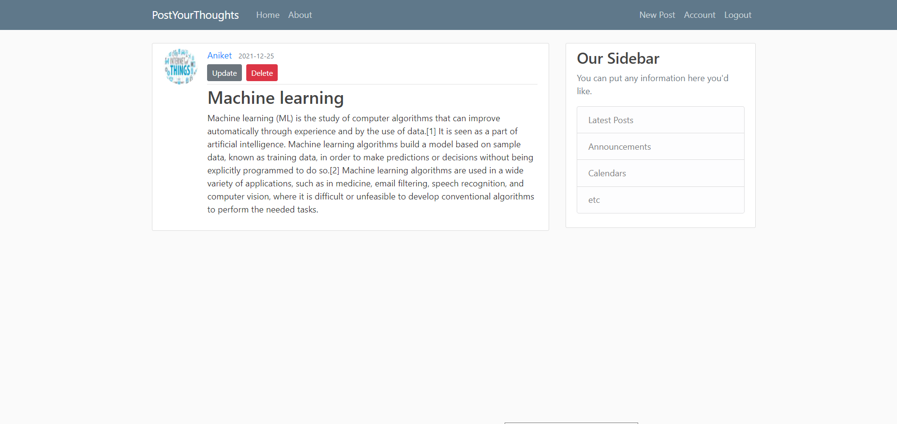
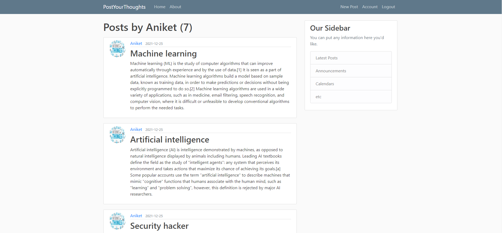

# PostYourThoughts
- PostYourThoughts is a social website where registered users can share ideas, information, interests and other forms of expression through their posts.
- Include features such as the CRUD operation (Create, Read, Update, Delete), pagination technique and User authentication system.
- Tech stacks used in the front end are HTML, CSS and Bootstrap framework. For the Backend and database, Flask framework and SQLAlchemy was utilized.   

## Screenscots

### Home page

### Login Page

### Register Page

### User Account Page

### Create New Post 

### Edit Post

### My Posts 

